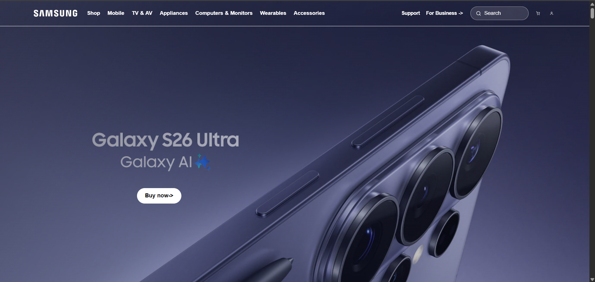
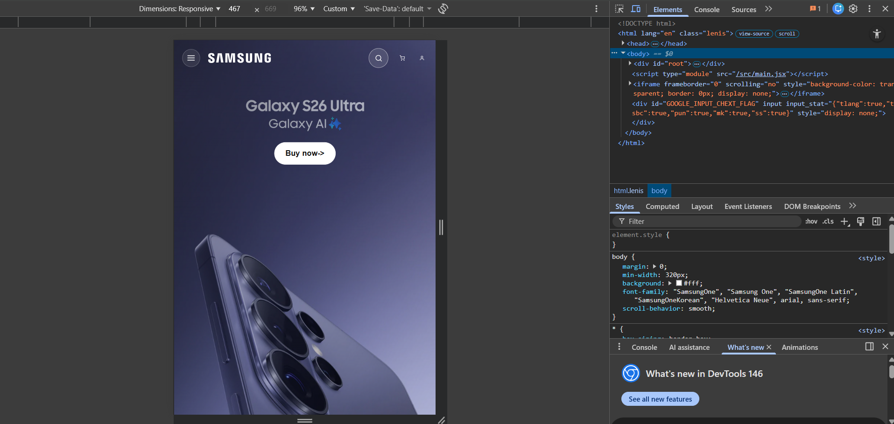

# 🚀 Samsung One UI Inspired Website

A modern **Samsung One UI-inspired frontend interface** built to replicate clean, minimal, and user-friendly mobile UI/UX.

🔗 **Live Demo**: https://samsung-inspired-ui.vercel.app/

---

## ✨ Overview

This project is inspired by Samsung’s **One UI design system**, focusing on simplicity, accessibility, and smooth user experience.

I recreated the interface using modern frontend technologies and enhanced it with smooth animations and responsive design.

---

## 🎯 Features

- 📱 Fully responsive design (mobile, tablet, desktop)
- 🎨 Clean and minimal UI inspired by Samsung One UI
- 🎞️ Smooth animations using GSAP
- ⚡ Interactive UI elements and transitions
- 🧩 Component-based architecture using React

---

## 🧠 Tech Stack

- ⚛️ React
- 🎞️ GSAP + ScrollTrigger
- 🎨 Tailwind CSS
- 💻 JavaScript (ES6+)

---

## 🎥 Demo


---

## 📸 Screenshots




---

## 🚀 What I Learned

- Implementing real-world UI/UX design principles
- Creating smooth animations with GSAP
- Building responsive layouts using Tailwind CSS
- Structuring scalable frontend projects with React

---

## 📌 Future Improvements

- Add more interactive features
- Improve animations and micro-interactions
- Optimize performance
- Add dark mode support

---

## 📂 Installation

```bash
git clone https://github.com/yourusername/samsung-ui-clone.git
cd samsung-ui-clone
npm install
npm run dev
```
